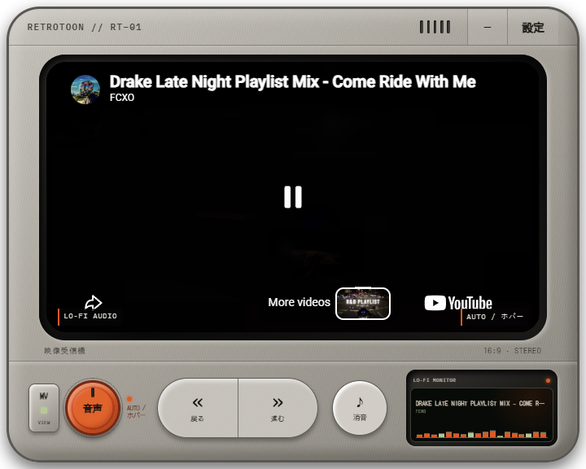

# RetroToon

**English** · [Español](#español)

RetroToon is a resizable, always-on-top desktop widget that plays two independent YouTube playlists: one on the main screen and another through the music player. Despite the retro cartoon and lo-fi presentation, you can display any public or unlisted YouTube playlist whose videos allow embedding. It keeps every preference on your computer and includes no playlists, accounts, telemetry, API keys, downloads, or redistributed media.



## Install and first setup

Download the build for your computer from the repository's **Releases** page:

- Windows x64: setup `.exe` or portable `.zip`.
- macOS Intel: x64 `.dmg` or `.zip`.
- macOS Apple Silicon: arm64 `.dmg` or `.zip`.

On first launch, select English or Spanish and paste one public or unlisted YouTube playlist for the main screen and another for the music player. These can contain cartoons, music, podcasts, documentaries, or any other embeddable public YouTube videos. RetroToon verifies that both links are reachable and contain videos before enabling the player. More playlists can be added, renamed, reordered, selected, imported, or exported from Settings.

Existing v1.0.2 preferences are migrated in place; playlist links, position, size, volume, and other preferences are preserved.

### Unsigned-app notices

The initial builds are not code-signed.

- **Windows SmartScreen:** choose **More info** and then **Run anyway** only if the file came from this repository's official Release.
- **macOS Gatekeeper:** Control-click RetroToon in Finder, choose **Open**, then confirm. You can also allow it from **System Settings → Privacy & Security**.

## YouTube limitations

Playback and metadata depend on YouTube and an internet connection. Private/deleted videos, regional restrictions, age restrictions, advertising, copyright rules, and disabled embedding may interrupt or prevent playback. RetroToon does not bypass these controls and does not download, extract, alter, or redistribute YouTube content.

## Development

Requirements: Node.js 24.15 or newer, npm, and the platform's standard Electron build tools.

```powershell
npm.cmd ci
npm.cmd start
```

Checks and local builds:

```powershell
npm.cmd run typecheck
npm.cmd test
npm.cmd audit --omit=dev
npm.cmd run make
```

The release workflow builds Windows x64 plus macOS x64/arm64 artifacts when a tag matching `package.json` (for example `v1.1.0`) is pushed. It uses only `GITHUB_TOKEN`; no signing credentials are configured.

See [CONTRIBUTING.md](CONTRIBUTING.md) for contribution guidance and [SECURITY.md](SECURITY.md) for vulnerability reports. RetroToon is available under the [MIT License](LICENSE).

---

## Español

RetroToon es un widget de escritorio redimensionable y siempre visible que reproduce dos playlists independientes de YouTube: una en la pantalla principal y otra mediante el reproductor de música. Aunque tiene una presentación retro de cartoons y lo-fi, puedes mostrar cualquier playlist pública o no listada de YouTube cuyos videos permitan la reproducción insertada. Guarda todas las preferencias localmente y no incluye playlists, cuentas, telemetría, claves API, descargas ni contenido redistribuido.

## Instalación y configuración inicial

Descarga desde **Releases** el archivo correspondiente:

- Windows x64: instalador `.exe` o `.zip` portátil.
- macOS Intel: `.dmg` o `.zip` x64.
- macOS Apple Silicon: `.dmg` o `.zip` arm64.

En el primer inicio, elige inglés o español y pega una playlist pública o no listada para la pantalla principal y otra para el reproductor de música. Pueden contener cartoons, música, podcasts, documentales o cualquier otro video público de YouTube que permita embedding. RetroToon comprueba que ambas sean accesibles y tengan videos antes de habilitar el reproductor. En Settings puedes añadir, renombrar, ordenar, seleccionar, importar y exportar más playlists.

Las preferencias de v1.0.2 se migran sin pérdida: se conservan los enlaces, posición, tamaño, volumen y demás ajustes.

### Avisos por falta de firma

Las builds iniciales no están firmadas.

- **Windows SmartScreen:** selecciona **Más información** y **Ejecutar de todas formas** solamente si descargaste el archivo del Release oficial de este repositorio.
- **macOS Gatekeeper:** haz Control-clic sobre RetroToon en Finder, selecciona **Abrir** y confirma. También puedes autorizarla en **Configuración del Sistema → Privacidad y seguridad**.

## Limitaciones de YouTube

La reproducción y los metadatos dependen de YouTube y de una conexión a Internet. Los videos privados/eliminados, restricciones regionales o de edad, publicidad, reglas de copyright y bloqueo de embedding pueden interrumpir o impedir la reproducción. RetroToon no evita estas restricciones y no descarga, extrae, modifica ni redistribuye contenido de YouTube.

## Desarrollo

Requiere Node.js 24.15 o posterior, npm y las herramientas estándar de compilación de Electron para cada plataforma. Usa los mismos comandos mostrados en la sección inglesa. Consulta [CONTRIBUTING.md](CONTRIBUTING.md), [SECURITY.md](SECURITY.md) y la [licencia MIT](LICENSE).
